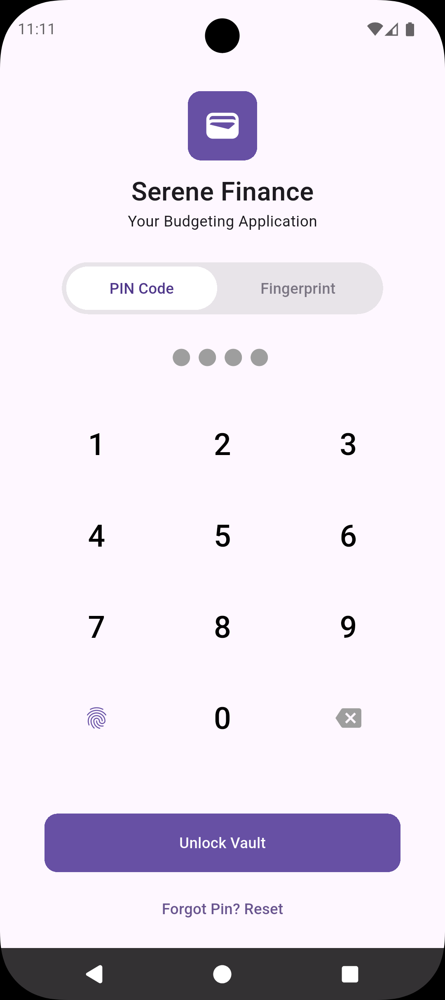
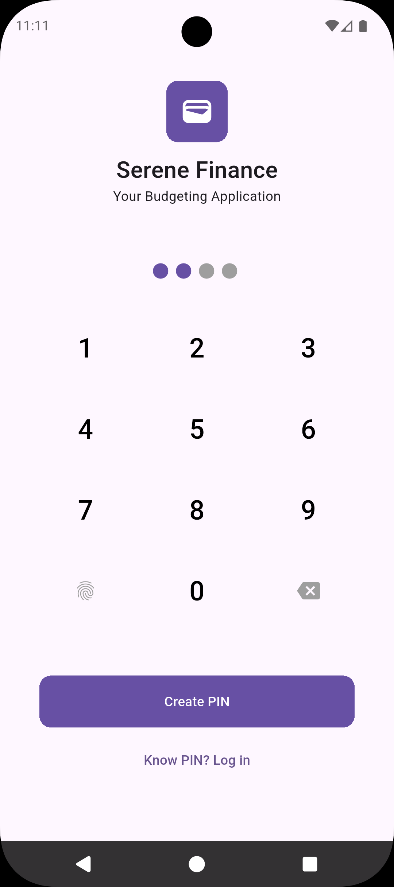
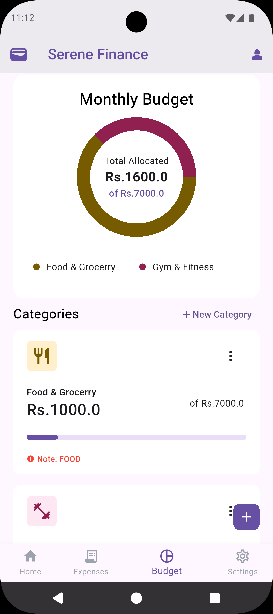
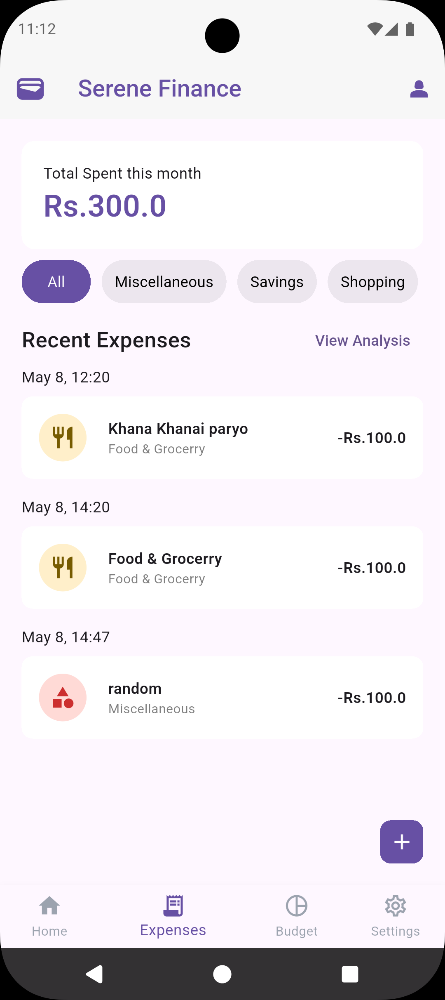
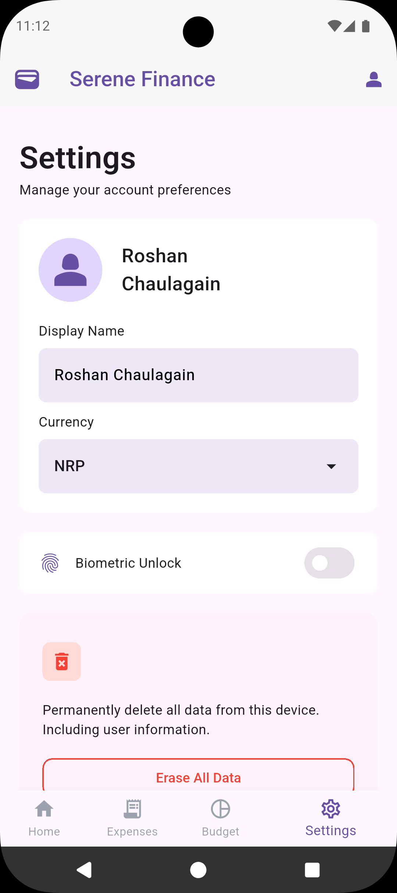

# Serene Finance – Offline Personal Finance & Budgeting App

Serene Finance is a fully offline personal finance application built with Flutter. It helps users manage their income, create budgets, record expenses, and track disposable income without requiring an internet connection.

All data is stored locally on the device using SQLite, and users can secure access with a 4-digit PIN and optional biometric authentication.

---

## Screenshots & Features

### Login Page



The login screen allows users to securely access the application using a 4-digit PIN. If enabled, users can also authenticate using fingerprint or device biometrics.

**Features:**

- 4-digit PIN authentication
- Optional biometric login (fingerprint/Face ID)
- Local-only authentication
- Secure access to financial data

---

### Register Page



New users can create an account by entering their name and setting a 4-digit PIN.

**Features:**

- User registration
- PIN setup
- Local account creation
- No internet required

---

### Income Dashboard (Home Page)


The landing page provides a monthly overview of the user's finances, showing total income, total expenses, and remaining disposable income.

**Features:**

- Total income summary
- Total expenses summary
- Remaining disposable income
- Quick financial overview

---

### Budgeting Page



Users can allocate budgets to different categories based on their income. A pie chart visually represents the distribution of budget allocations.

**Features:**

- Create and manage budget categories
- Allocate amounts to categories
- Pie chart visualization
- Real-time budget overview

---

### Expenses Page



The expenses page displays all recorded expenses in a chronological list, along with timestamps and total expenses.

**Features:**

- Add manual expenses
- Timestamped expense entries
- Expense history list
- Total expense calculation

---

### Settings Page



The settings page provides options for personalization, security, and data management.

**Features:**

- Change user name
- Select preferred currency
- Enable/disable biometric login
- Export application data
- Delete all stored data
- Logout

---

## Core Features

- Fully offline finance management
- Secure login with 4-digit PIN
- Optional biometric authentication
- Income tracking
- Budget allocation with pie chart
- Expense tracking with timestamps
- Local data export
- Data reset and cleanup

---

## Tools & Technologies Used

### Development Framework

- Flutter
- Dart

### Local Database

- SQLite

### Authentication

- 4-digit PIN authentication
- Biometric authentication

### Charts & Visualization

- Pie chart package for budget distribution (fl_chart)

### Development Tools

- Visual Studio Code

### Version Control

- Git
- GitHub

---

## Architecture & Code Organization

The project is structured to separate UI, classes structure, enums, data handling and other global constants.

```text
lib/
├── classes/
├── Enums/
├── pages/
├── pages/subpages/
├── dbHandling.dart
├── sessionManagement.dart
├── SomeConstants.dart
├── Authenticator.dart
├── SomeConstants.dart
└── main.dart
```

---

## Data Storage

All user information, budgets, incomes, and expenses are stored locally using SQLite. No data is sent to external servers, ensuring complete privacy and offline usability.

---

## Security Features

- 4-digit PIN protection
- Optional biometric login
- Local-only data storage

---
